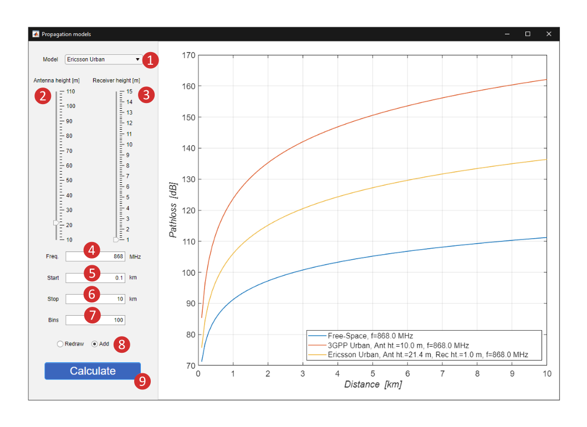

# Propagation Models

## How To Control the Application

1. Select a requested propagation model from the dropdown menu.
2. Set the height of the transmitter antenna. It must be noted that in the case of 3GPP, the *Antenna height* parameter represents the height above the average rooftop level. This parameter is not available for the Free-Space model, as it is not part of the path-loss formula.
3. Set the height receiver antenna height. This parameter is not available for 3GPP Urban and Free-Space models as they are not using it for path-loss calculation.
4. Set the carrier frequency in MHz. The allowed input range is dynamically changed based on the selected propagation model.
5. Select the initial distance point for the path-loss calculation.
6. Set the terminal distance point for the path-loss calculation.
7. Define how many points are inserted between initial and terminal distance.
8. Chose the figure rendering option.
    - Redraw – the figure area is always rewritten with the newest data.
    - Add – the path-loss curve is added to the actual figure without rewriting the old data.
9. Click on the *Calculate* button to calculate the path-loss values and draw the path-loss curve.

### Currently Available Propagation models
- Free-Space _(20-100000 MHz)_
- Okumura-Hata Urban _(150-1500 MHz)_
- Okumura Hata Rural _(150-1500 MHz)_
- 3GPP Urban _(700-2600 MHz)_
- ECC33 Big City _(700-2600 MHz)_
- ECC33 Medium City _(700-2600 MHz)_
- Ericsson Urban _(150-1900 MHz)_
- Ericsson Suburban _(150-1900 MHz)_
- Ericsson Rural _(150-1900 MHz)_
- COST231  Large City _(150-2000 MHz)_
- COST231  Medium City _(150-2000 MHz)_
- COST231  Small City _(150-200 MHz)_